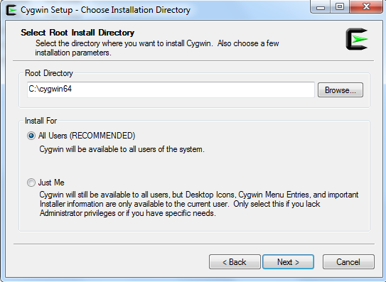
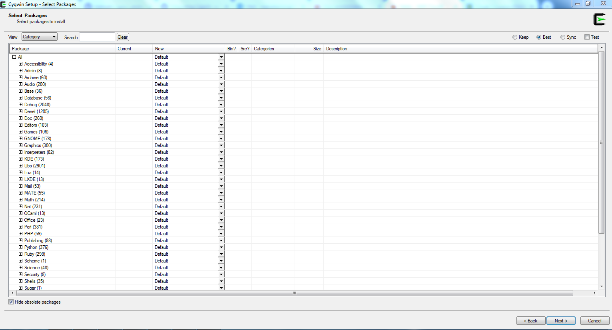
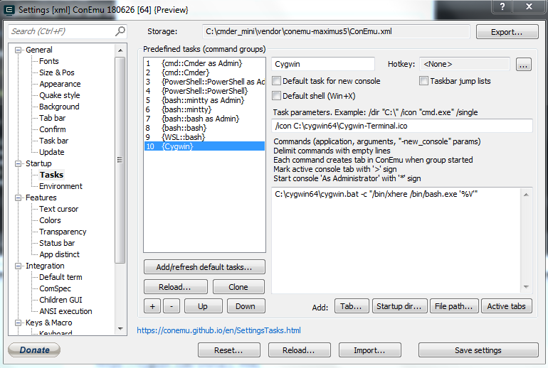
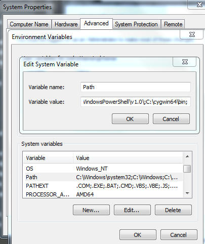
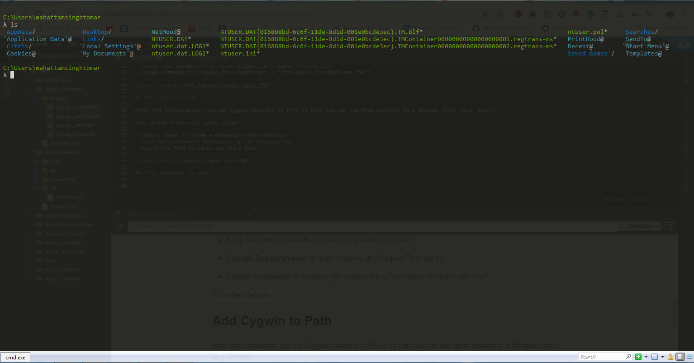

# cygwin_windows
Setting up Linux environment by using cygwin on windows

## Install Cygwin
Download the cygwin setup file and install the cygwin

        https://cygwin.com/install.html
        

## Installed required package in cygwin for you development environment

Install cmder command terminal (https://cmder.net/) to make it look better

- Once installed cmder then integrate cygwin and cmder by following below activity
- Create a new task by clicking the + button in Startup > Tasks
- Keep the name to something more recognizable (Cygwin)
- Change Task parameters to /icon <cygwin_dir>\Cygwin-Terminal.ico
- Change Commands to <cygwin_dir>\cygwin.bat -c "/bin/xhere /bin/bash.exe '%V'"
  

## Add Cygwin to Path

After the installation, you can Cygwin binaries to PATH so that you can use them natively in a Windows shell (e.g. Cmder).

Open System Properties using either:

- Control Panel → System → Advanced system settings
- Click on Environment Variables… in the Advanced tab
- select the Path variable and click Edit…

## Final terminal to user

